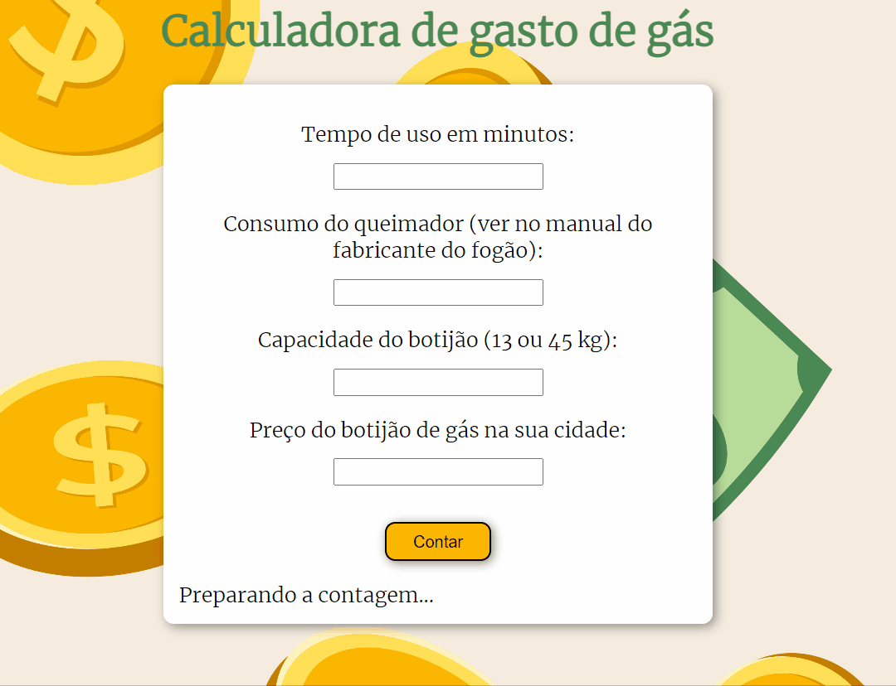

# 
 Calculadora gasto de gás

 Esse projeto foi feito a pedido da minha namorada, que sempre tinha que fazer manualmente, é uma calculadora aonde colocando os dados pedidos ele mostra quantos reais foi gasto na sua receita

 <a href="#features">Features</a> •
 <a href="#tecnologias">Tecnologias</a> •
 <a href="#autor">Autor</a>

---

 

### Features

- [x] Calculando <h1 align="center"> </h1>-
- [x] Quando deixam de colocar algum número <h1 align="center"> </h1>-

### Tecnologias

- [Html](https://www.w3schools.com/html/default.asp)
- [Css](https://www.w3schools.com/css/default.asp)
- [JavaScript](https://www.w3schools.com/js)

### Autor

MADE BY Thaynansp29 😎

<a href = "https://www.linkedin.com/in/thaynansp"> </img></a>
